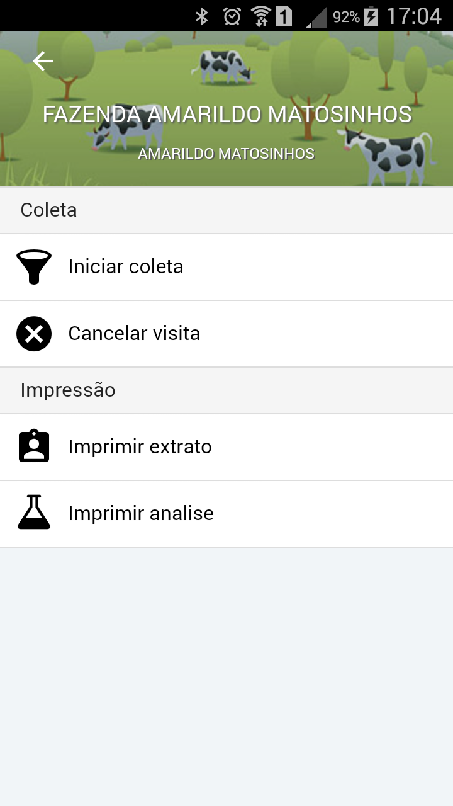
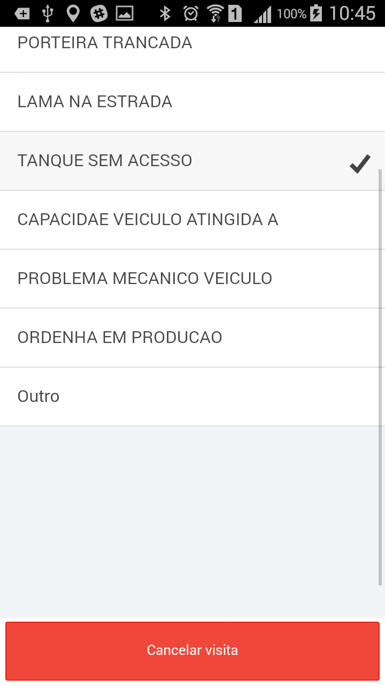

<link rel="stylesheet" href="../font-awesome.css">

##Cancelar Visita 

>> Se houver algum impedimento para acesso ao tanque resfriador, como o caso de uma porteira trancada,
estrada interompida ou outro motivo qualquer, o motorista(agente de coletas) deve registrar o motivo
do impedimento, e inclusive registrar uma foto para comprovar a situação.

### Cancelando a visita

> Acesse o menu com o itinerário (Relação das visitas que devem ser feitas na viagem), localize a fazenda e toque em seu nome na lista, 
isto abrirá o menu de opçòes, escolha 

