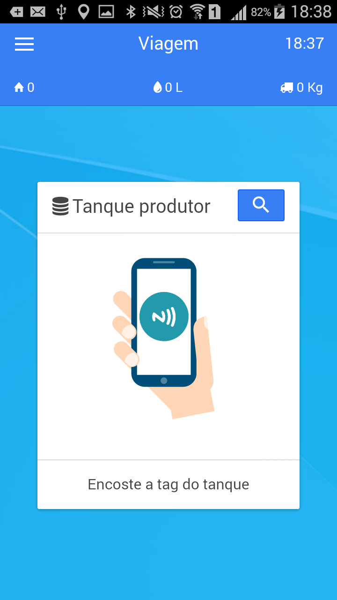
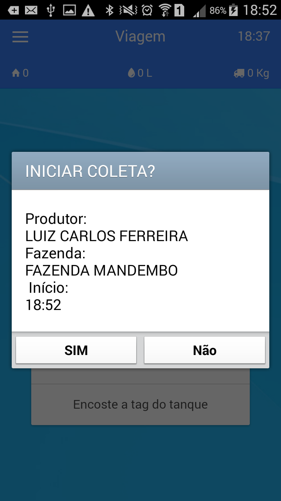
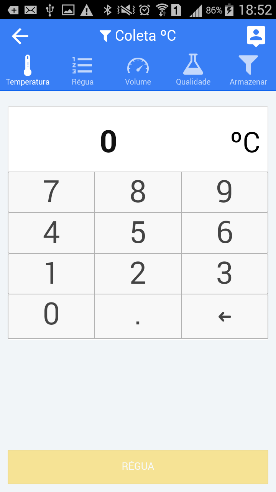
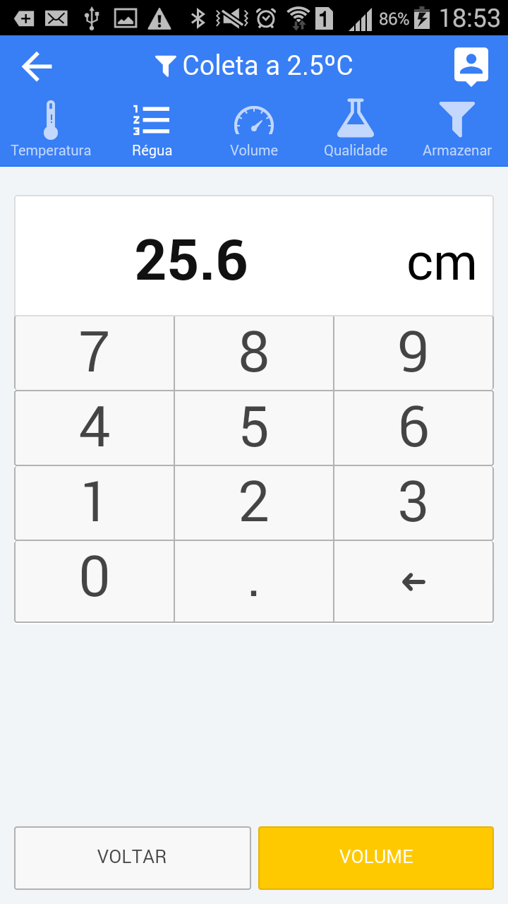
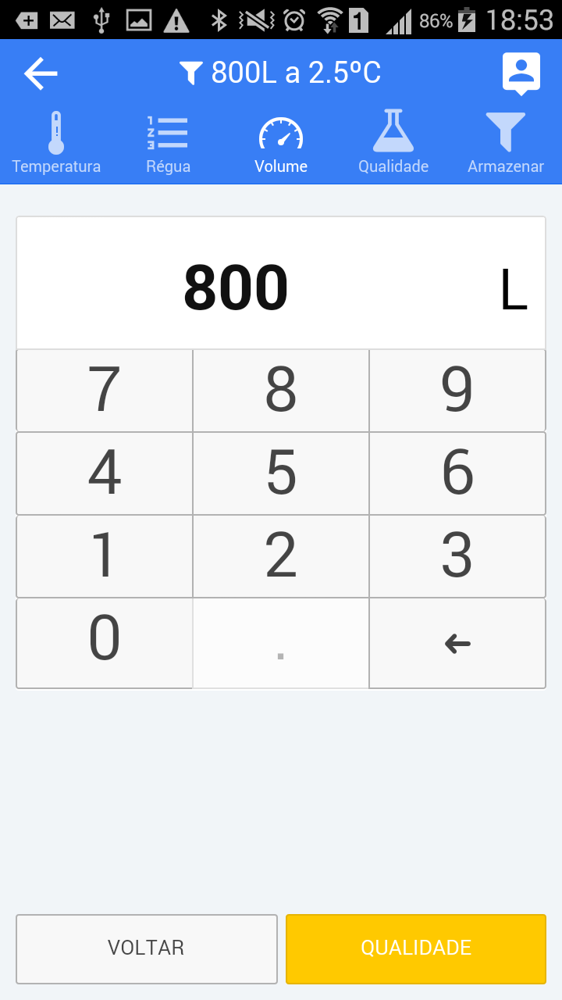
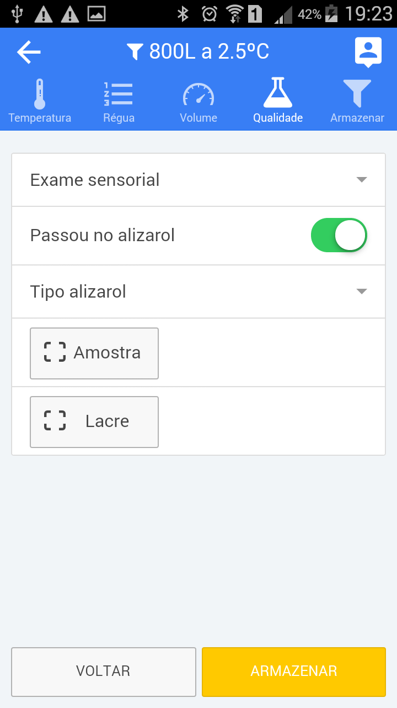
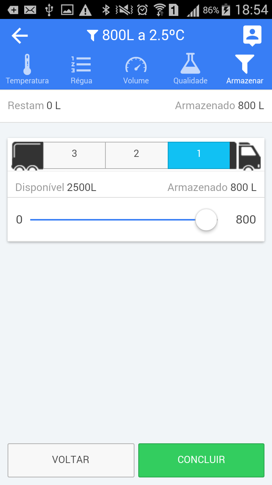
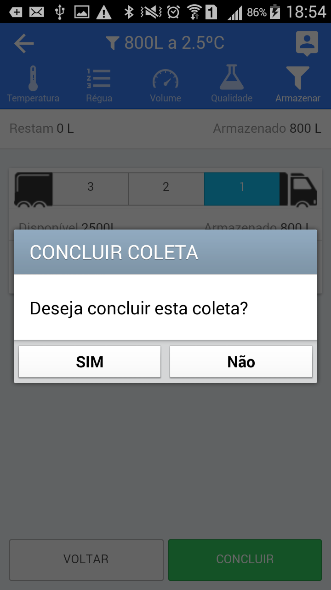
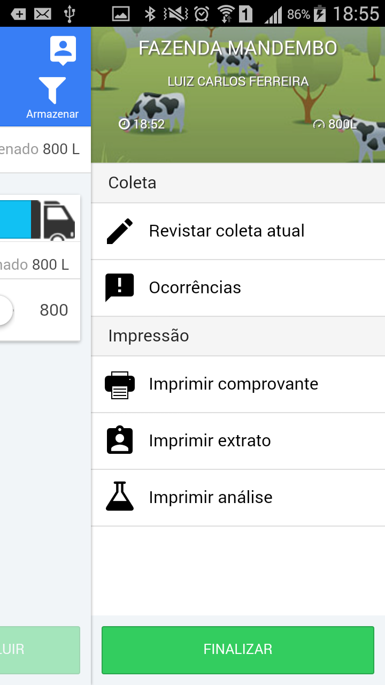

<link rel="stylesheet" href="../font-awesome.css">

##Registrando uma coleta   <i class="fa fa-pencil-square-o"></i> 

>Procedimentos para realizar o registro das coletas no aplicativo ::

---
I -  Identificando o produtor, fazenda e ponto de coleta 
---

>O Aplicativo pode ser configurado para identificar de diversas formas o ponto de coleta,
mas o meio mais comum e através da Tag (NFC). Existe também a possibilidade de identificar
por meio de código de barras e por geo-referência (GPS). 
Para Identificar o produtor e ponto de coleta, aproxime a parte de traz do celular da etiqueta (NFC) que geralmente
fica afixada na tampa do tanque resfriador, ou faça a leitura do código de barras.

>Se por algum motivo a etiqueta não puder ser alcançada, o ponto de coleta poder ser escolhido
de uma lista (Itinerário), clicando no ícone  <i class="fa fa-search"></i> . 

---
II -  Conferindo os dados do produtor
---
>Após a leitura do identificador do ponto de coleta, a tela abaixo será exibida para conferência. Para prosseguir, clique em "Sim"
se os dados estiverem corretos.

---
III -  Anotando a temperatura do tanque 
---
>A Temperatura do tanque resfriador é o primeiro registro que o APP considera na visita. O Sistema pode estar configurado para validar o valor digitado, e se for informado
um valor fora do intervalo permitido, uma mensagem de alerta será exibida e o sistema <b>"NÃO"</b> permitirá que os outros dados sejam digitados até que se informe uma temperatura
dentro do intervalo correto.

---
IV -  Anotando a medida da régua
---
>Anotar a medida da régua pode ser "opcional", dependendo da política da empresa (Cooperativa ou Laticínio), mas sempre aconselhamos que ao medir o volume de leite no tanque resfriador,
o agente de coleta informe também a medida da régua, pois esta informação pode ser útil para ajudar a esclarecer diferenças nos valores anotados ou diante de uma
reclamação do produtor.
Se não for necessário informar o valor, basta clicar no botão <b>[VOLUME]</b> para continuar os registros.

---
V - Anotando o volume de leite
---
>Está informação certamente é a mais importante no registro da visita e deve ser inserido com todo o cuidado.
Milk's Rota irá conferir o valor inserido com os últimos 3 valores digitados nas visitas anteriores. Caso exisita uma diferença
marcante, o sistema exibirá um alerta, mas <b>"NÃO"</b> impedirá que o registro seja feito.
 

---
VI - Alizarol - Resultado 
---
>A maioria das informações desta tela <b>"NÃO"</b> são obrigatórias, mas sempre que possível é bom fornecê-las para melhorar o controle
do laticínio.    
Quando o leite é <b>aprovado</b>, após passar pelo exame de alizarol, não será necessário fazer nenhuma alteração no botão de controle <b>"Passou no alizarol"</b>,
que permanecerá nao cor <b>"Verde"</b>, indicando que o leite está bom para coleta. Se for <b><u>reprovado</u></b>, este botão deve ser "Tocado" e passará para a posição de "desligado"
e automaticamente ficará <b><u>vermelho</u></b>, indicando que o leite não foi aprovado para coleta. Neste momento o App irá
enviar uma notificação para o laticínio ou para a pessoa responsável pelo controle de coleta informando o cancelamento da coleta pelo  motivo de não ser
aprovado no exame de alizarol.  
O Agente de coleta poderá ainda escolher no controle "Tipo Alizarol", o tipo de de alizarol que aplicou para fazer o exame (Não é obrigatório)  
Amostra e Lacre:: 
O número de amostra e o número do lacre de contrapova devem ser informado do lado direito dos botões que tem o mesmo nome. Se o agente de coleta (Motorista) clicar no botão <b>[AMOSTRA]</b> ou <b>[LACRE]</b>, o sistema abrirá o leitor de códigos de barras,
para o caso dos potes serem identificados com códigos de barras. Se isto acontecer por engano, o agente de coleta deve clicar no botão de retorno <i class="fa fa-undo"></i> do celular para fechar a câmera.

---
VII - Armazenamento no veículo
---
> Informar o compartimento (Boca) do tanque do veículo, para onde o leite será bombeado.  
O App fará o controle automático do volume armazenado em cada compartimento e informará a quantidade possível de ser 
armazenada em cada (Boca) e, quando o volume for <b>MAIOR</b> que a capacidade, a cor do tanque escolhido
ficará <b>"Vermelha"</b> indicando que o leite poderá <b>Derramar</b>, momento que o motorista deverá
monitorar o enchimento da boca e mudar o bombeamento para outro compartimento ou boca.  
Escolha um dos compartimentos do veículo para onde o leite será bombeado, clicndo no número da boca, depois "arraste" todos os controles deslizantes para o lado direito da tela, o sistema calculará o volume que foi armazenado e o volume disponível dos compartimentos.
Se a cor do compartimento escolhido ficar "vermelha", escolha outro compartimento e também deslize os controles para a direita. Ao final, o botão <b>[CONCLUIR]</b> ficará habilitado (vede forte), indicando
que o processo foi finalizado. o Sistema exibirá então o menu de impressão do comprovante. Coleta registrada !

---
VIII - Confirmando o final da coleta
---
>Após registrar todos os dados da coleta o sistema pedirá uma confirmação para encerrar a coleta. 
Clique no botão <b>"Sim"</b> para encerrar definitivamente a coleta.

---
IX - Impressão de ticket de coleta, extrato e análise
---
>Ao concluir o registro da coleta ou uma correção, o menu de impressão será apresentado para que os comprovantes
de coleta, extrato ou análise da qualidade possam ser impressos.   
Clique na opção <b> <i class="fa fa-print"></i> Imprimir Comprovante</b> para imprimir o ticket da coleta.   
As opções <b><i class="fa fa-flask"></i> Imprimir Analise </b> e 
<b><i class="fa fa-file-text"></i> Imprimir Extrato</b> só emitem os respectivos relatórios se houver
dados vindos do programa do laticínio para este produtor ou ponto de coleta.   
Após imprimir os comprovantes, clique no botão <b>[FINALIZAR]</b> para encerrar a coleta.

