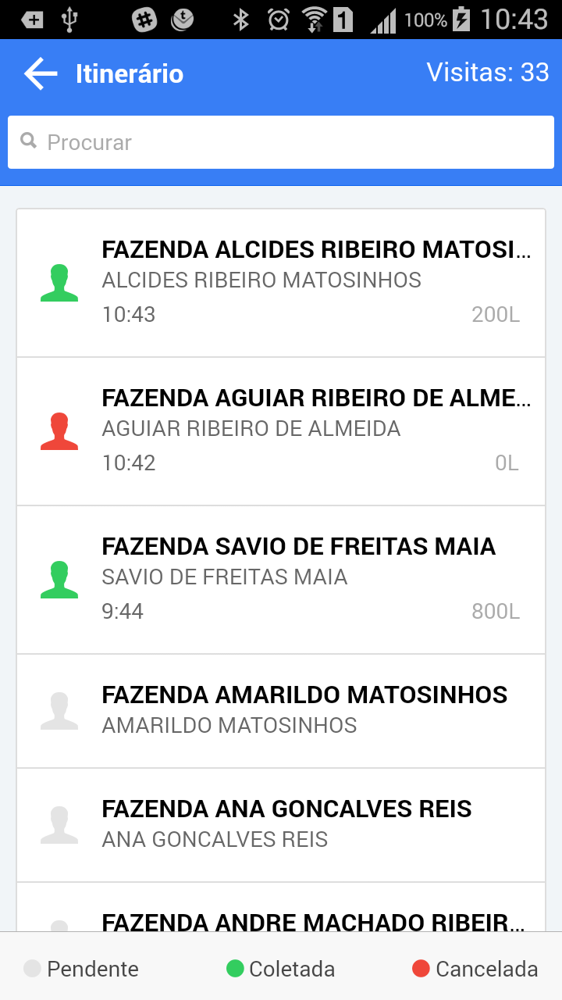
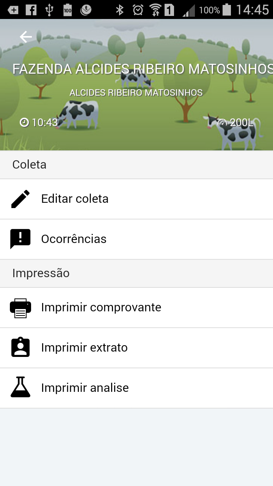
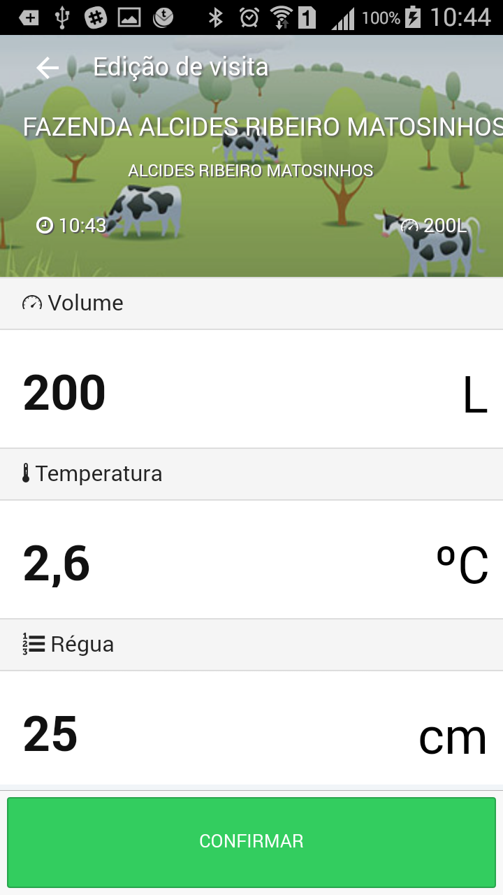
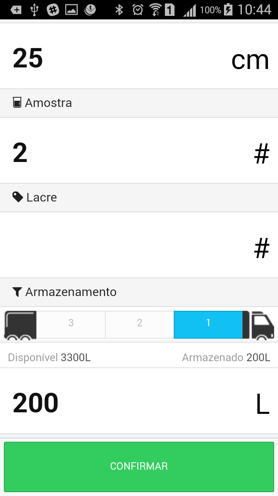

<link rel="stylesheet" href="../font-awesome.css">

###Corrigindo uma coleta
> As regras de utilização do aplicativo ditam que somente a última coleta realizada
pode ser alterada (corrigida). Quando um registro de coleta e finalizado ele é posicionado no topo
da lista de visitas, e somente ele pode ser modificado, até que o outro registro seja feito.

>Para corrigir os dados da coleta, toque no primeiro item da lista de visitas e será exibido o menu
com as opções, escola a opção <i class="fa fa-edit"></i> "Editar Coleta" , para exibir o formulário com
todos os registros realizados e faça as alterações necessárias.

 
> o formulario de edição de coletas exibe todas os dados editaveis da coleta, faça as devidas
alterações.

### Finalizando a edição do registro da coleta::

> <b>Importante!!</b>  Lembrando-se de alterar, no final da lista, <b>o volume armazenda no(s) tanque(s)</b> , 
caso contrario, o botão para [CONFIRMAR] <b>NÃO</b> ficará habilitado.

 

