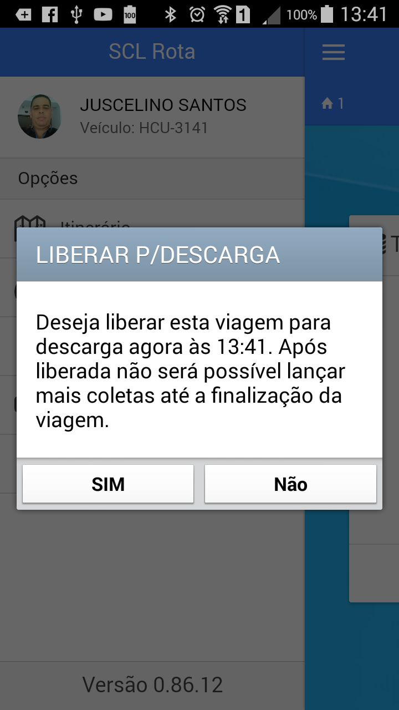
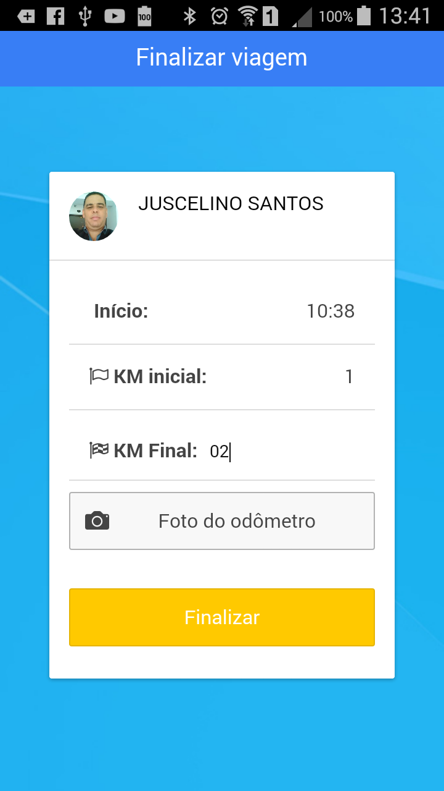
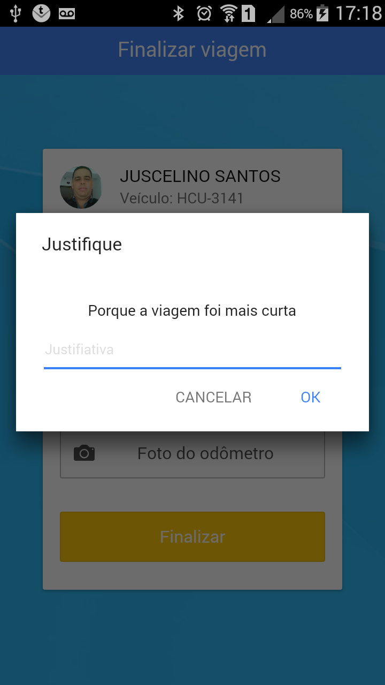
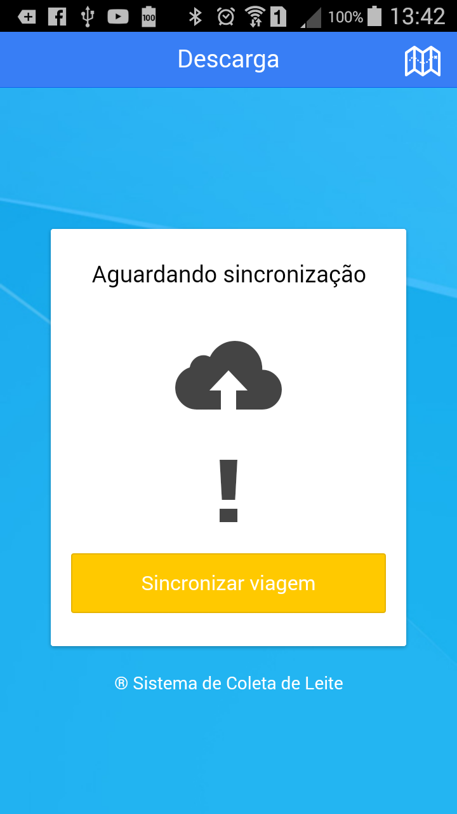
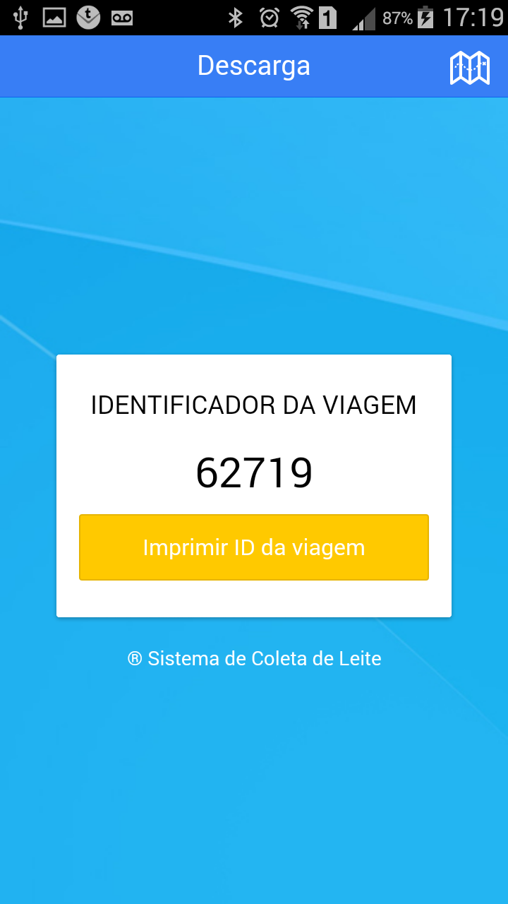

<link rel="stylesheet" href="../font-awesome.css">

##Fechar Viagem

>Após registrar todas as visitas na linha de coleta, o motorista precisará, comandar o fechamento da viagem
no App. 
>Para comandar o fehcamento da viagem, abra o menu lateral por meio do botão ( <i class="fa fa-bars"></i>). no canto superior esquerdo da tela
principal do App. 
Escolha a opção <b> Liberar para descarga</b> e confirme o fechamento.

##Informar Km Final

>Assim como na abertura de vaigem, no fechamento, o App solicita que seja informado a quilometragem
final do hodômetro do veículo, e de acordo com a configuração, poderá ser exigida uma foto de comprovação. 

 

## Justificar Quilometragem

> Dependendo das configurações, ao final da viagem, pode ser solicitado que se informe o motivo pelo qual
o deslocamento na linha foi <b>Maior</b> ou <b>Menor</b>. Esta informação é util nos acertos de frete (Carreto) com
os motoristas que prestam serviços aos Laticínios. 

>Se o App apresentar uma tela solictando a informação, escreva resumidamente o motivo.

> Após informar o Km final da viagem, o sistema exibira a tela de sincronização, momento muito
importante para o processo, pois sem a sincronização, os registros feitos na viagem <b>Não</b>
chegarão aos computadores do laticínio.

##Impressão do Mapa de viagem

>Antes de sincronizar as informações, o agente de coleta deve, de acordo com a orientação do
laticínio, imprimir o mapa de coleta.  
O Mapa de coleta ou mapa de viagem é uma relação com os registros de todas as anotações feitas nas visitas. Um
Resumo de volumes e informações das coletas, bem como os totalizados de volume e deslocamento na linha.

>  O botão  ( <i class="fa fa-map-o"></i> ) que fica no canto superior direto da tela de sincronização
permite a impressão do mapa, mas no menu lateral também existe a opção de impressão deste mapa, a qualquer momento,
desde que não esteja sendo feito nenhum registro de coleta no momento.

## Identificador da viagem

>Dependendo da configuração ajustada, o sistema pode exibir a tela de impressão do identificador único
da viagem. Este identificador é a garantia de que os registros chegaram ao servidor e que as coletas estão salvas.

 