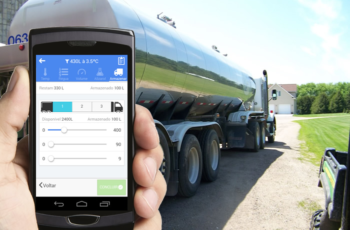

<link rel="stylesheet" href="font-awesome.css">

# Milk's Rota (SclRota) - Manual de Operação.

##Aplicativo Coletor

A plataforma Milk's Rota é composta por uma série de serviços idealizados e moldados para atender as necessidades de automação do processo de 
coleta de leite, atuando principalmente no registro das informações obtidas na captação e coleta do leite.
 

  O Aplicativo Coletor Milk' Rota foi escrito com o principal objetivo de fornecer aos <b>Agentes de Coleta</b> (Motoristas), condições de manter as informações geradas nas visitas  
  as fazendas produtoras de forma organizada, acessível e correta.

  As funcionalidades implementadas pelo aplicativo coletor foram idealizadas com base na rotina do agente de coleta e apresentadas em uma interface simples e funcional, 
  evitando operações complicadas que pudessem afetar a rotina diária do
   Agente de Coleta.

  

  

##Registro das operações de coleta pelo aplicativo

  Este manual tem por objetivo apresentar as pricipais funcionalidades do aplicativo coletor, esclarecer dúvidas
  e prover uma forma rápida de consulta  aos procedimentos corretos de anotação dos registros
  das visitas nas fazendas produtoras.   

##Funcionamento

  O App Milk' Rota foi desenvolvido para possibilitar que os registros das visitas sejam feitos independente da <b>cobertura de sinal</b>
  de rede ou <b>internet</b>, sendo assim, após realizada a carga incial dos dados e abertura de viagem, <b>NÃO</b> há necessidade de acessso a rede ou internet para que o 
  App funcione. Os registros das coletas podem ser anotados, mesmo sem esta cobertura.
  Quando o agente de coleta (Motorista) se desloca pelas fazendas produtoras e o sistema encontra uma cobertura de rede, o App Coletor
  envia as informações para o laticínio ou cooperativa, mas é na chegada do veiculo á plataforma de descarga, quando o agente de coleta
  Finaliza a viagem e "Sincroniza" os dados, que as informaçòes são efetivamente enviadas e armazendas.

##Equipamentos

  Para que os agentes de coleta consigam realizar todos registros das operações, o sistema utiliza alguns equipamentos::
    
  1. Celular 
  2. Impressora Portátil 
  3. Etiquetas NFC 
  

  Recomendamos que o celular seja carregado <b>diariamente</b>,mas na maioria dos casos existe um carregador veícular, tando para o celular como para a
  impressora, que devem ser utilizados no caso de falta de carga nas baterias.

  A impressora no modelo MPT-II ou Leopardo, conseguem operar por até 3 dias com uma única carga. Recomenda-se que
  os equipamento recebam carga completa, antes do início da viagem.

  

   As etiquetas NFC - Não utilizam baterias e são ativadas no momento em que o celular é aproximado das mesmas para fazer a leitura.
  
