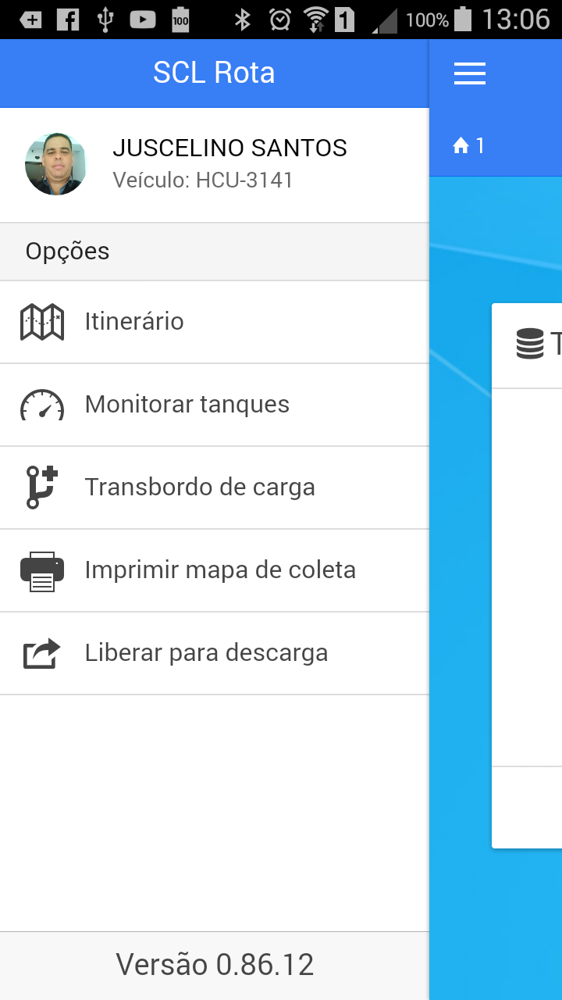
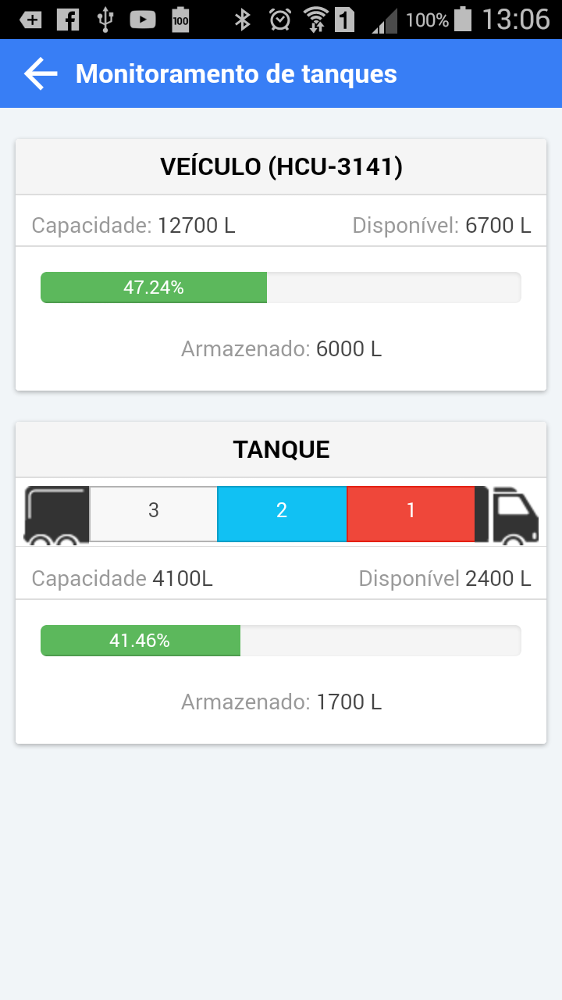

<link rel="stylesheet" href="../font-awesome.css">

##Total de Leite no tanque

> Em alguns momentos da viagem, o motorista precisa saber o volume de leite que foi armazenado
nos compartimentos do tanque do veículo, e para isto ele pode acionar o menu lateral por meio do botão 
no canto superior esquerdo da tela principal de coleta  ( <i class="fa fa-bars"></i> )

> Ao tocar na opção "Monitorar taques", o App exibe uma tela com a figura de um veículo e os números
representando a quantidade de compartimento do tanque de transporte que está configurado para o veículo escolhido
na abertura da viagem.  
> Tocar no número que representa o compartimento do tanque, exibe as informações do volume armazenado
e a <b>disponibilidade.</b> Se um compartimento já estiver completamente ocupado, ele será destacado na cor <b>Vermelha</b>.

