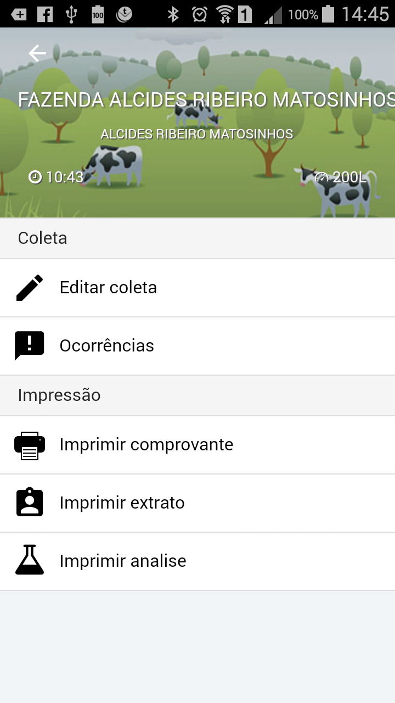
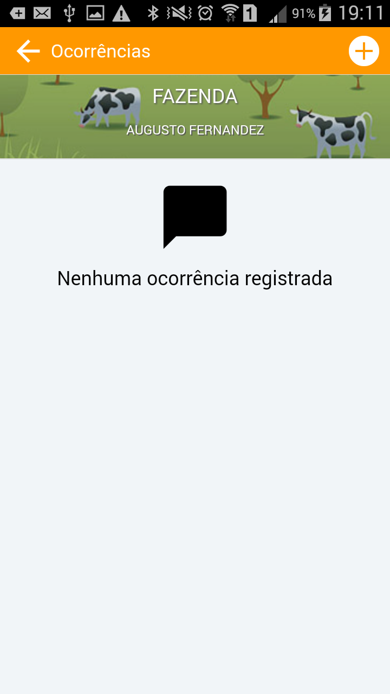

<link rel="stylesheet" href="../font-awesome.css">

##Ocorrências e Fotos

>> Se for necessário registrar algum acontencimento ou fato importante sobre a visita na fazenda ou na linha , o Milk's Rota
possui a funcionalidade de registro de ocorrências com foto.
>> Para registrar uma ou mais ocorrências, acesse o menu de itinerário, com a lista de visitas (itinerário) e
selecione a fazenda tocando em seu nome na lista. Será exibido o menu de opções, escolha 

 

>> Na tela de ococrrências, toque no ícone <i class="fa fa-plus-circle"></i> para iniciar um novo registro.

>> As ocorrências precisam ser registradas por meio de uma foto e uma legenda, com informações básicas
sobre o que está acontecendo. Toque no ícone da foto <i class="fa fa-camera"></i> e registre a imagem, depois, <b>obrigatoriamente</b>
escreve uma <b>"Legenda"</b> ou texto para dizer o que está acontecendo, ex. ("Tanque congelando o fundo"), depois toque no botäo <b> [Registrar Ocorrência] </b> 
e aguarde o aplicativo voltar pra a tela principal de ocorrências.

  

> Para sair do módulo de registro de ocorrência, sempre volte pela ícone da "seta" <i class="fa fa-arrow-left"></i> que se
encontra no canto superior direito da tela principal das ocorrências.

><b>Importante!</b> Você poderá registrar quantas ocorrências e fotos forem necessárias. 