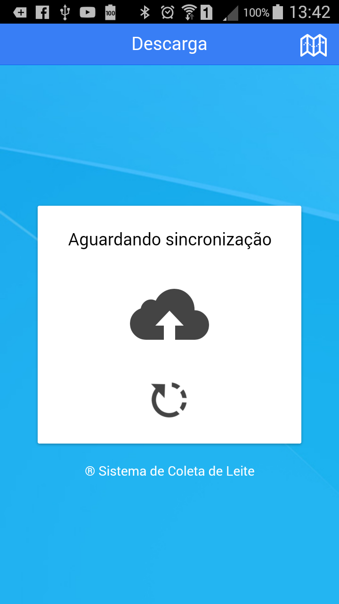
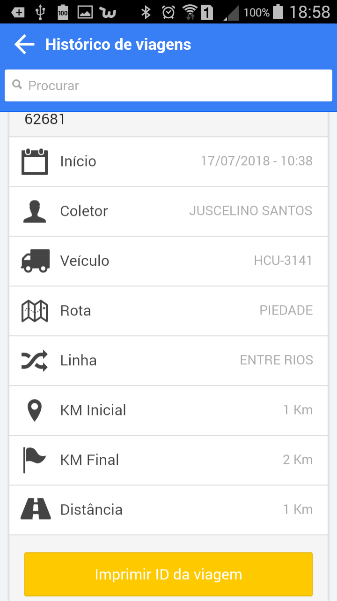

<link rel="stylesheet" href="../font-awesome.css">

##Atualização da base e do aplicativo

>O App Milk's Rota tem funções para atualizar automaticamente a base de dados. Após o encerramento
da viagem, o sistema exibe a tela de monitoramento do processo de download das informações que permitem
os registro na linha de coleta. 

>Quando, novas versões são liberadas pela equipe desenvolvedora, pode ser exibida pelo App uma tela
dizendo que uma versão está disponível, pedindo autorização para instalar os novos recursos. Neste
momento, o agente de coleta pode tocar na opção <b>[Instalar]</b> e deixar o processo executar as operações
e ao final, o App estará atualizado.

## Funções adicionais

>No menu lateral da tela principal, existem algumas funções adicionais que estão disponíveis somente
após o fechamento da viagem, ou antes da abertura. 

>1 - Histórico da viagem : Mostra o resumo das viagens e permite a reimpressão do <b>Identificador da Viagem</b> 
>2 - Backup das viagens: Permite o reenvio dos dados de uma viagem para o servidor 
>3 - Configurações : Acesso as funções de preparação e ajuste do comportamento do App. Acessível somente com senha especial. 
 

  
 