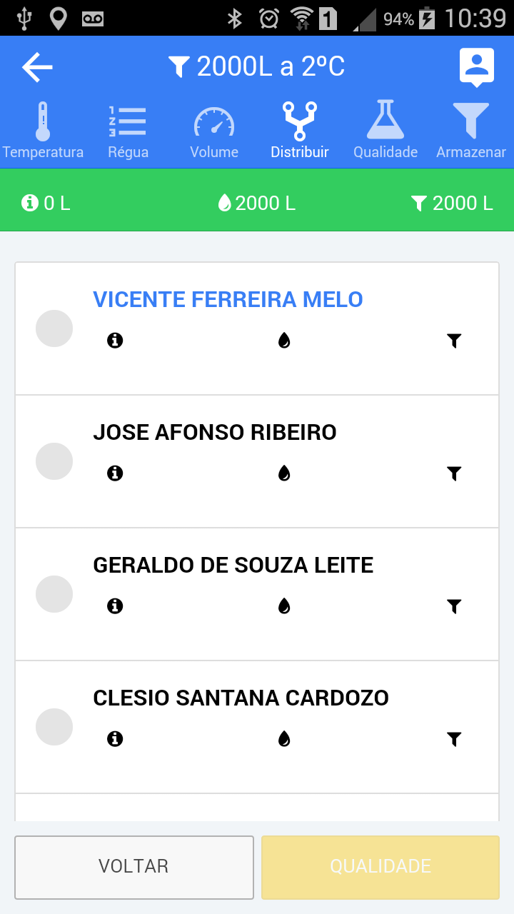
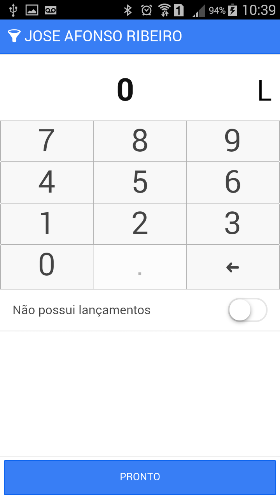
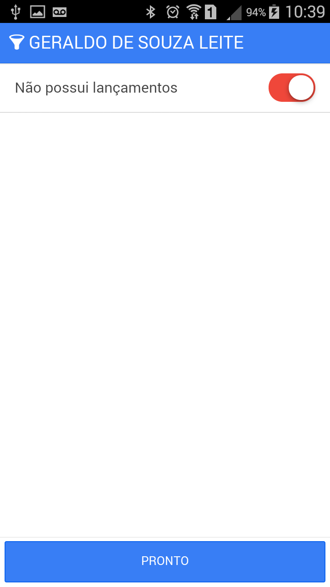
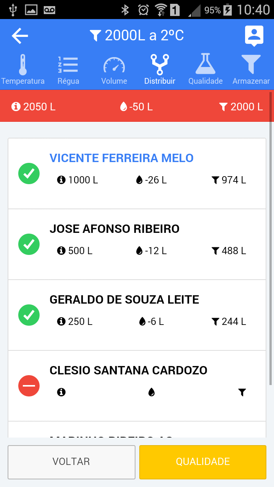
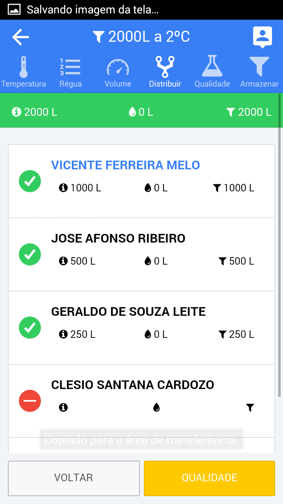

<link rel="stylesheet" href="../font-awesome.css">

##Tanque Coletivo (comunitário)

> Os registros em tanques coletivos seguem as configurações e acordos ditados pelo laticínio, desta forma
o comportamento do App depende destas configurações. 
Para os casos onde a distribuição do volume coletado é feito pelo agente de coleta(Motorista), uma nova tela será
exibida no momento da coleta. Ela contem a relação das pessoas que entregam leite no ponto de coleta
coletivo, e oferece a possibilidade de registro dos volumes individuais de cada produtor participante.

 > <b>Obs: O Nome da lista que está em destaque (azul) , representa o responsável pelo tanque ou ponto de coleta.</b>

## Informando o valor para cada produtor

>Para distribuir o valor para cada produtor, basta tocar o nome correspondente na lista de participantes e será exibida a tela de 
lançamento.

 

> Informe o volume <b>Total</b> entregue pelo produtor e depois toque no botão <b> [PRONTO] </b>.  
Repita o processo para todos os produtores da lista.

## Produtor não entregou leite 

>Quando um produtor não entregou leite em um tanque coletivo, mas está na lista de coleta, o
agente de coleta (Motorista) deve tocar no nome correspondente na lista e marcar o botão
<b>"Não Possui lançamentos"</b>, para conseguir prosseguir com o registro da coleta.

## Diferenças entre volume aferido e volume anotado

> As diferenças entre o volume aferido na medida do tanque e o volume anotado
pelos participantes do tanque coletivo são tratadas de acordo com orientaçào do laticínio. Dependendo da configurção, a diferença pode ser
<b> 1 - Rateada proporcionalmente de acordo com o volume que cada produtor entregou </b> ou 
<b> 2 - Ser lançanda "Totalmente" para o responsável pelo tanque. </b> 
Quando existe difereça entre a distribuição e o volume aferido, o topo da tela de distribuição fica na cor <b>"Vermelha"</b>.

## Finalizando a distribuição da coleta

> Quando os volumes individuais estão registrados, o App apresenta a tela de distribuição com o topo na cor <b>Verde</b>
e habilita o botão <b>Qualidade</b> para que se prossiga com o registro final da coleta.

