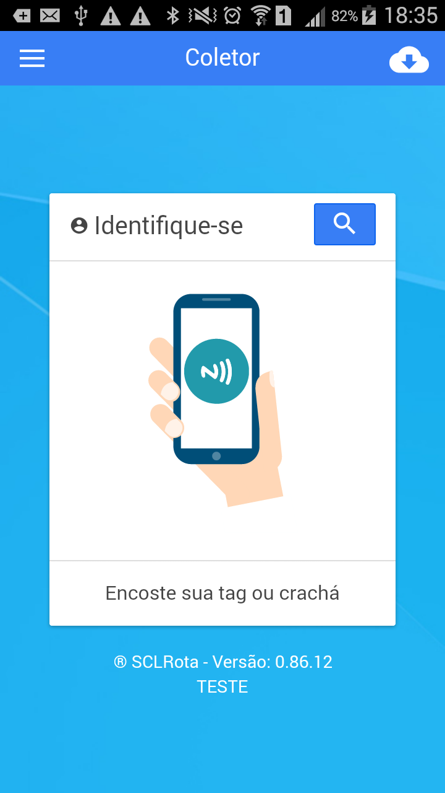
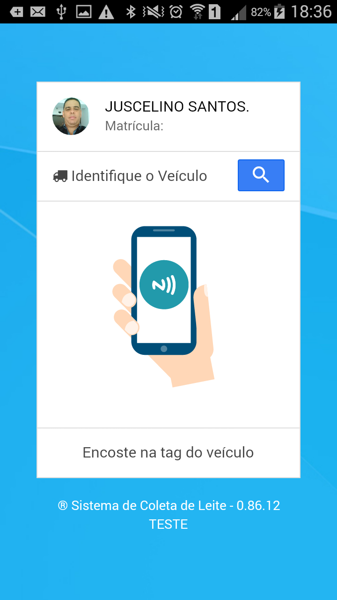
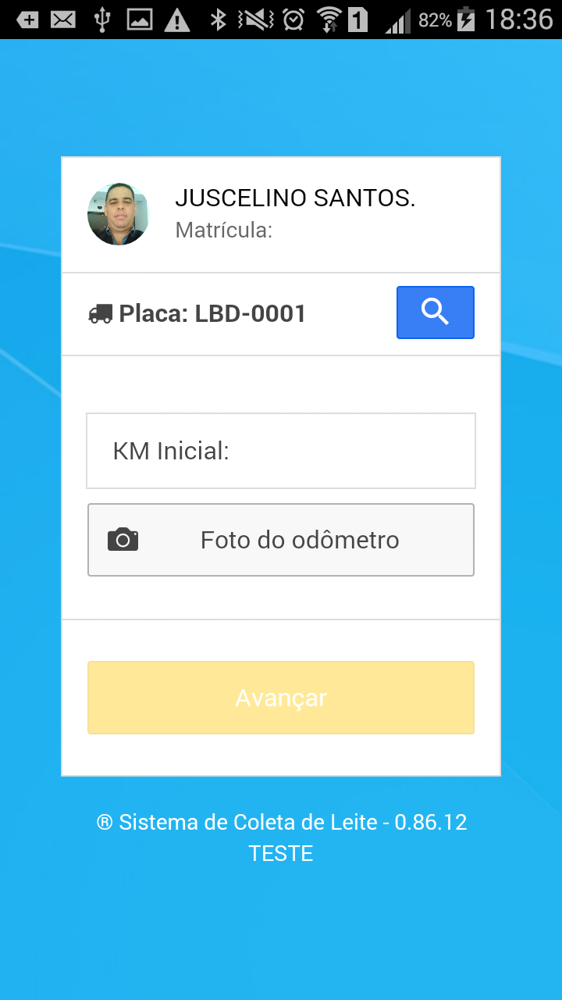
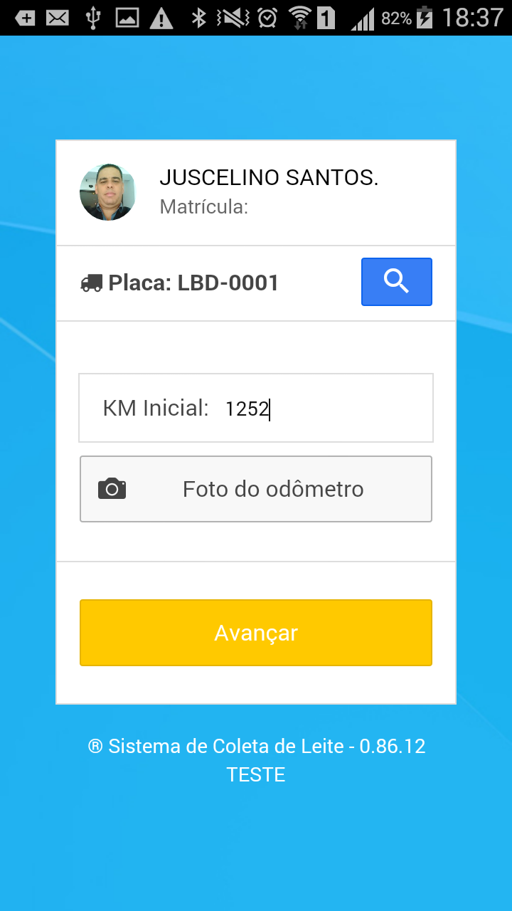
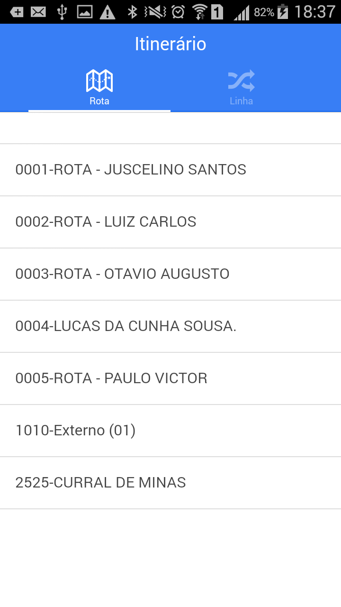
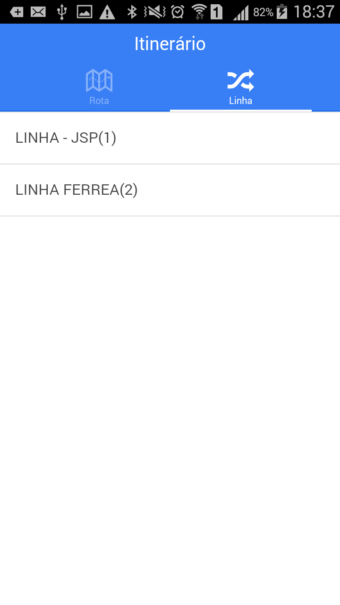
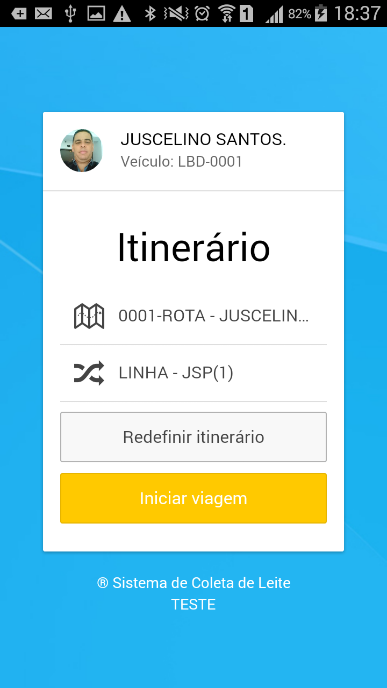

<link rel="stylesheet" href="../font-awesome.css"> 

##Abertura de viagens   <i class="fa fa-flag-o"></i> 

O registro do início da viagem deve ser feito no exato momento em que
o deslocamento é iniciado. Não há necessidade de cobertura de rede ou
internet para que este procedimento funcione. As telas abaixo exemplificam
o comportamento do Aplicativo.

----
1. Identificação do Agente de Coleta (Motorista)
----

O Agente de Coleta deve aproximar,  a (Tag) que o identifica,  da parte de traz do
celular ou clicar no ícone de busca <i class="fa fa-search"></i> para exibir uma lista com todos os nomes
dos motoristas cadastrados e clicar em seu nome.
 
 

Após a identificação do motorista, o aplicativo exibirá o nome selecionado e solicita que seja feita a identificação do veículo.  

----
2. Identificação do Veículo 
----
o Agente de coleta (Motorista) deve aproximar, a (Tag) que identifica o veículo, da parte de traz do celular ou 
clicar no ícone de busca <i class="fa fa-search"></i> para exibir uma lista com todos as placas 
dos veículos cadastrados e clicar em uma para escolhe-la. 

finalizada a identificação do veículo, o próximo passo será registrar a quilomentragem inicial:

----
3. KM - Saída 
----
Nesta tela, o motorista deve informar a quilomentragem que está registrada no painel do veículo e , se for solicitado, fazer uma foto
para comprovar os números do odômetro. Fazer a foto é opcional, a menos que a empresa ajuste o aplicativo para exigir, e neste caso, o processo só
irá continuar se a foto for feita.

----
4. Foto do Velocímetro 
----
Ao clicar no botão  <i class="fa fa-camera"></i> o aplicativo irá acionar a câmera do celular para que seja
feita a foto do painel e logo após registrada a foto, deve-se clicar no botão <b>[Avançar]</b>

----
5. Escolhendo a Rota 
----
>>Rotas sao conjuntos de linhas, servem apenas para agrupar as linhas que são feitas pela mesmo transportador
ou que estão na mesma unidade do laticínio. Escolher a rota que representa a região ou plataforma onde o motorista vai 
descarregar o leite quando finalizar a viagem. 

----
6. Escolhendo a Linha 
----
>As linhas representam o conjunto de fazendas que devem ser visitadas em uma viagem.
Toda a relação de fazendas e produtores está ligada a linha escolhida. É importante
escolher a linha correta do dia de trabalho, pois se por algum motivo o agente de coleta (Motorista)
não chegar até o tanque resfriador, ele terá condições de escolher a fazenda em
uma lista e assim registrar a coleta, cancelar, fazer uma ocorrênca, etc.

----
7. Iniciando a Viagem 
----
>Quando todos os passos inciais forem concluídos, o sistema exibirá a tela de abertua de viagem,
onde haverá um resumo de todas as escolhas que o motorista fez para inciar a viagem. Se houver
necessidade, ele poderá corrigir alguma informação de abertura clicando no botão <b>[Redefinir Itinerário]</b>,
e acertar as escolhas. 

>Após a conferência do itinerário, clicar no botão <b>[Iniciar Viagem]</b>. O Aplicativo
passrá então para a tela de registro de coletas, que será feito a partir da 1a. fazenda, até
chegar no local, o motorista pderá deixar o celular no mode de descanso para economizar bateria.
